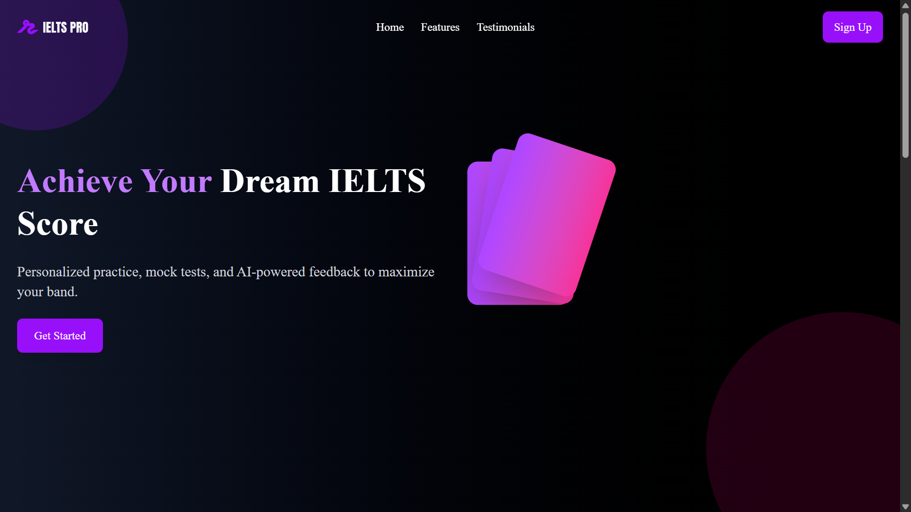
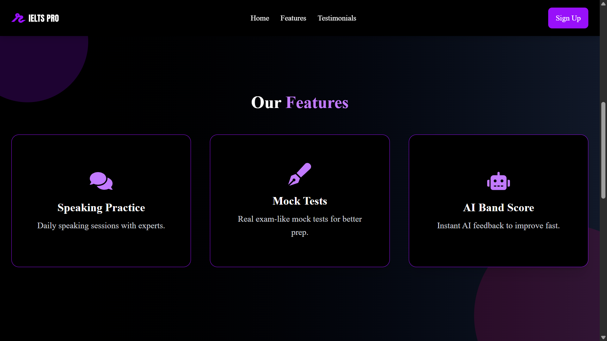
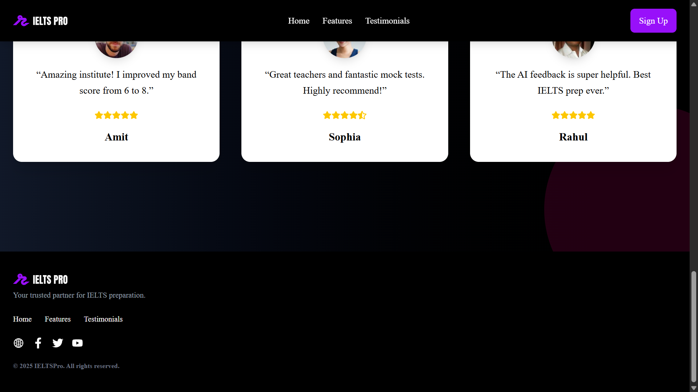

# ⚡ React Auth UI with Framer Motion & TailwindCSS

A sleek, modern **React project -> ILETS PRO** built with **TailwindCSS** and **Framer Motion**, featuring a **beautiful landing page (Hero, Features, Testimonials)** and **authentication pages (Login & Register)**.

---

## ✨ Features Overview

| Component        | Description                                                                     |
| ---------------- | ------------------------------------------------------------------------------- |
| **Hero**         | Eye-catching landing section with floating shapes, animated text & CTA.         |
| **Features**     | Cards highlighting app benefits with hover animations & gradients.              |
| **Testimonials** | User feedback section with animated cards & smooth transitions.                 |
| **Login**        | Clean authentication page with responsive form & icons.                         |
| **Register**     | User sign-up page with validation-ready inputs and animations.                  |
| **Navbar**       | Fully responsive navbar with scroll effects, smooth scroll-to, and mobile menu. |

---

## 🚀 Tech Stack

* [React](https://reactjs.org/) – Frontend library
* [TailwindCSS](https://tailwindcss.com/) – Utility-first CSS framework
* [Framer Motion](https://www.framer.com/motion/) – Animation library
* [React Router](https://reactrouter.com/) – Navigation & routing
* [React Icons](https://react-icons.github.io/react-icons/) – Beautiful icons

---

## 📸 Screenshots

<p align="center">
  
  
  
  
</p>
---

## 🛠️ Installation & Setup

Clone the repo and install dependencies:

```bash
git clone https://github.com/Developer200010/ILETS-PRO.git
cd ILETS-PRO
npm install
```

Run the development server:

```bash
npm start
```

Build for production:

```bash
npm run build
```

---

## 📂 Project Structure

```
📦 src
 ┣ 📂 components
 ┃ ┣ 📜 Navbar.jsx
 ┃ ┣ 📜 Hero.jsx
 ┃ ┣ 📜 Features.jsx
 ┃ ┣ 📜 Testimonials.jsx
 ┃ ┣ 📜 Login.jsx
 ┃ ┣ 📜 Register.jsx
 ┃
 ┣ 📂 assets
 ┃ ┗ 📜 logo.svg
 ┣ 📜 App.js
 ┣ 📜 index.js
```

---


## 🌟 Show Your Support

If you like this project, please ⭐ the repo and share it with others!

Happy Coding 💻✨
